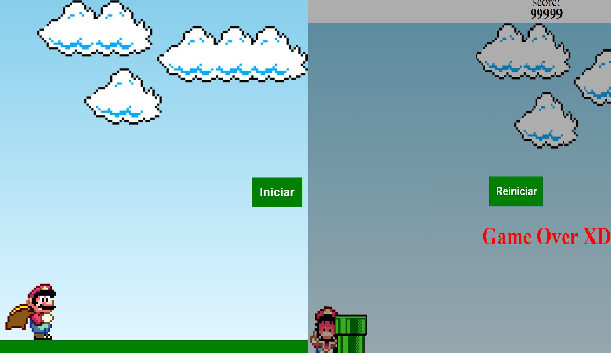

<h1 align="center"> 🎮 Mario Minigame </h1>

Guia do que foi usado para realizar este projeto.

  <a href="#-tecnologias">Tecnologias</a>&nbsp;&nbsp;&nbsp;|&nbsp;&nbsp;&nbsp;
  <a href="#-projeto">Projeto</a>&nbsp;&nbsp;&nbsp;|&nbsp;&nbsp;&nbsp;
  <a href="#-layout">Layout</a>&nbsp;&nbsp;&nbsp;|&nbsp;&nbsp;&nbsp;
  <a href="#memo-licença">Licença</a>

  

 

  

## 👨‍💻 Tecnologias

Esse Projeto foi desenvolvido com as seguintes tecnologias:

- JavaScript
- CSS e HTML
- Git e Github

## 💻 Projeto

Mario Minigame é um jogo que você controla o mario cujo o objetivo é evitar colidir no cano, salte e respectivamente marcará pontos no placar localizado acima do jogo. 

O meu objetivo foi homenagear e ao mesmo tempo praticar o meu conhecimento e criatividade,recriando um trecho do jogo que me trouxe muita alegria na infância.👻

- [Acesse o projeto finalizado, online](https://wlamiralves.github.io/mariominigame/)

## ⚙ Layout

As imagens e as músicas usadas foram encontradas na internet.

## 📜 Licença

Esse projeto está sob a licença MIT.

---

Feito por [Wlamir Alves](https://github.com/wlamiralves)